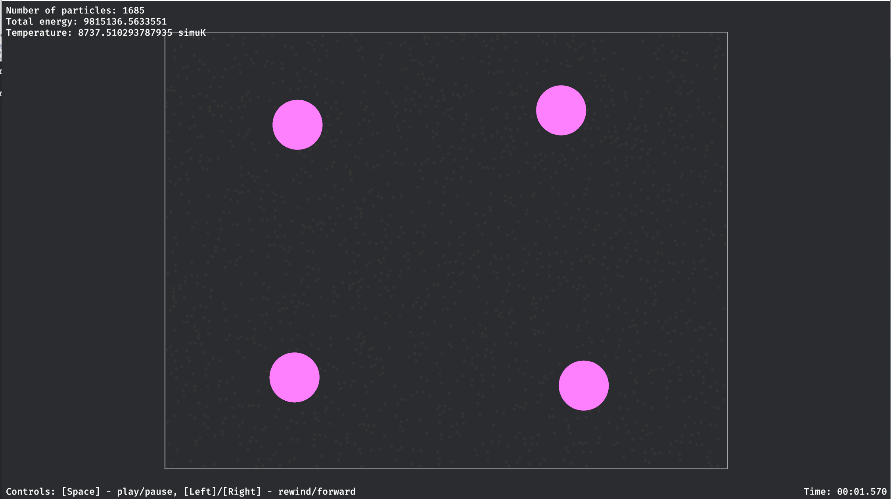
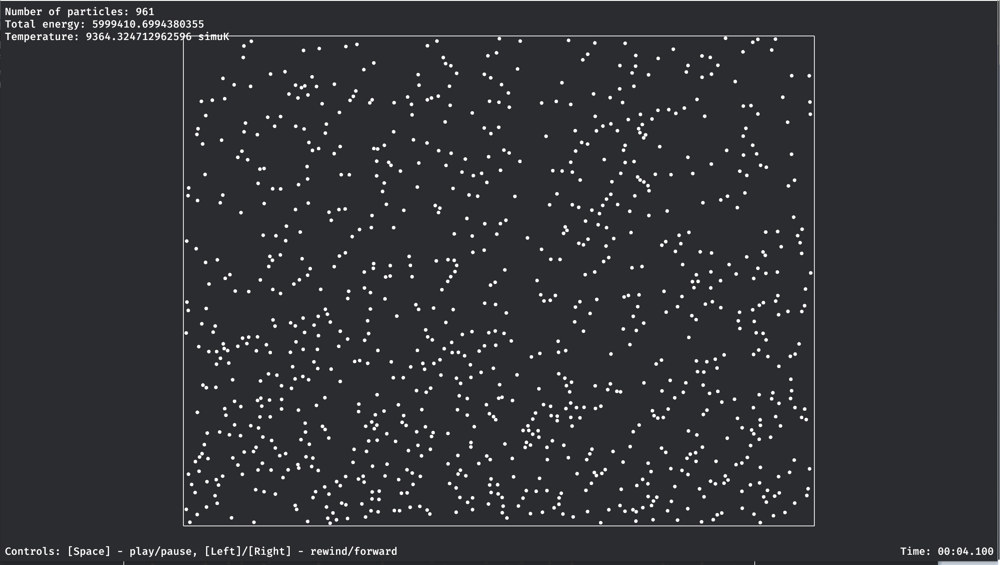
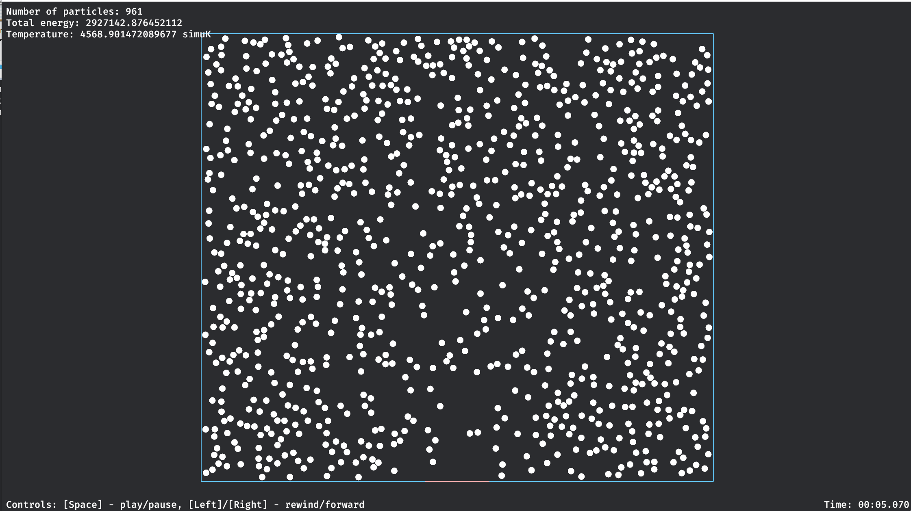
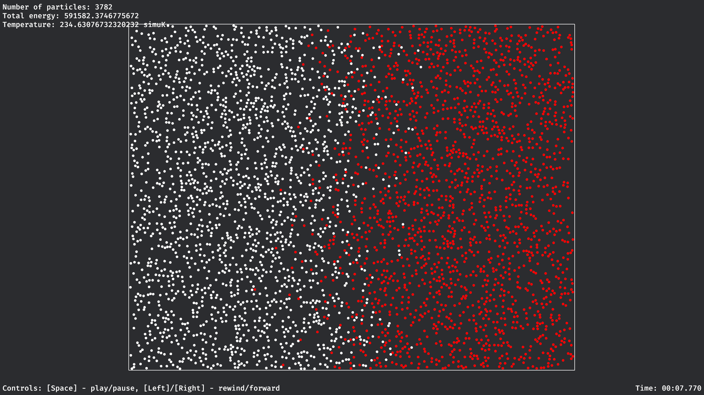

# m_sim - particle simulator

## Introduction
This is a pet project where I'm learning Rust and playing with particle simulation.
It supports defining of simple scene through YAML file.
This toy simulator doesn't serve any specific goal rather than some learning.

## Features
1. Ellastic collision between particles and wall
2. Walls have temperature and can be used to heat or cool down particles
3. Simulation chamber can have arbitrary shape formed by walls.
4. Gravity
5. Simulation is generated in background thread.
6. Basic playback controls.

## Usage
Execute m_runner. Specify the path to YAML file as argument.
Windows example:
m_runner.exe scenes/brownian.yaml

## Emergent Phenomena
Some emergent physical phenmomena can be observed using this simulation.

Brownian motion. Macro particles wiggle randomly due to collisions with micro particles.

Density gradient. Gravity increases density of th gas at the bottom.

Convection and heating. Heating and cooling particles by walls create convection current.

Diffusion. Two substances/gases diffuse into each other as time progresses.

## Future Improvements
Use spatial index to accelerate the collision detection. Currently the O(n^2) nature of
algorithm makes large simulation impractical.